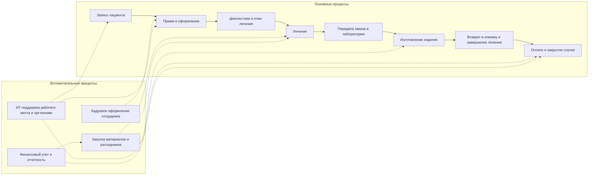
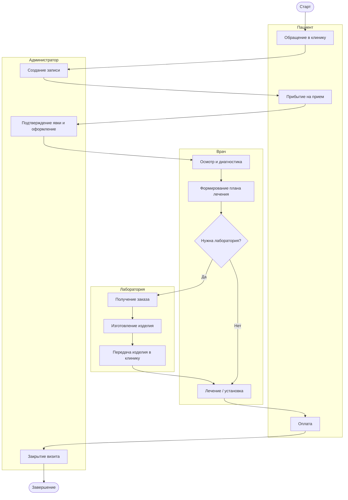
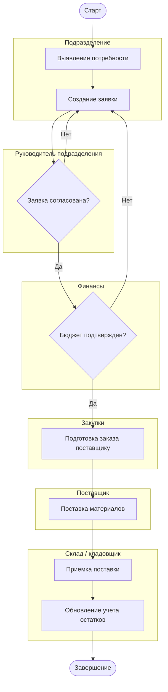
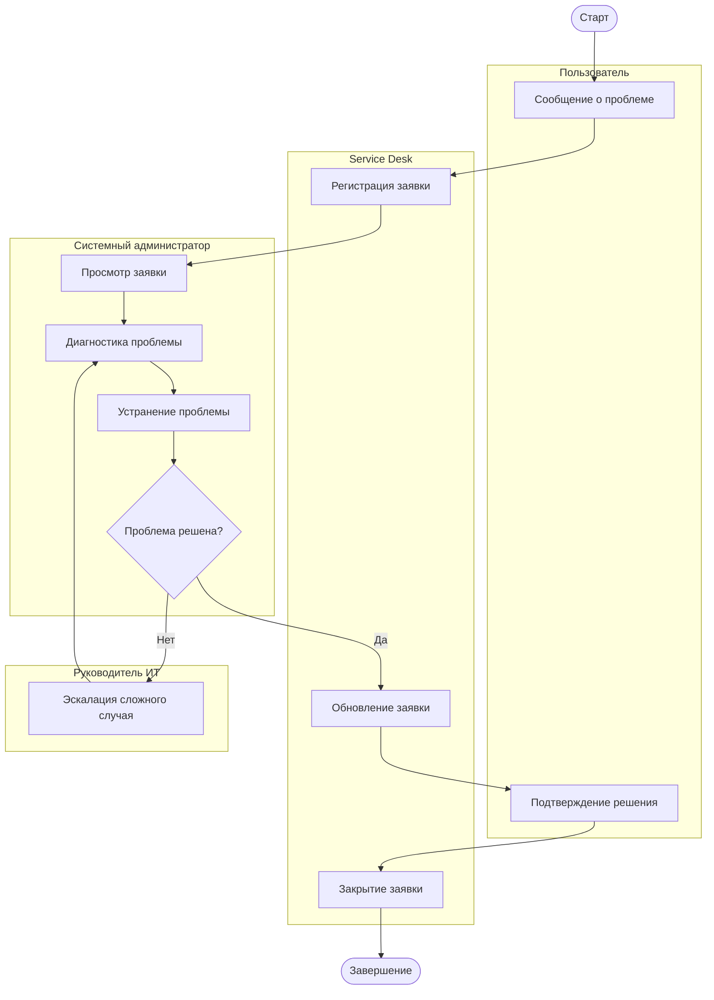
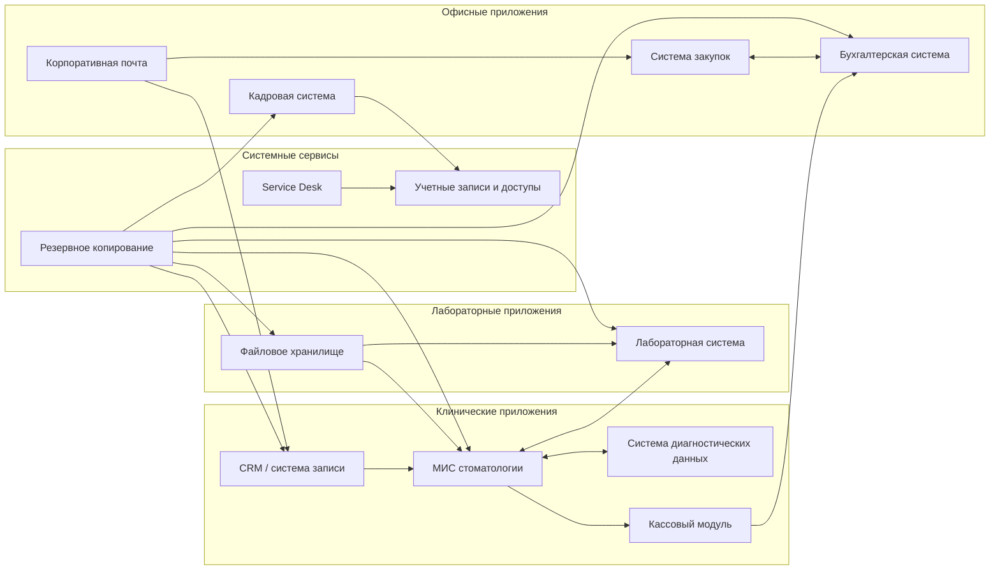
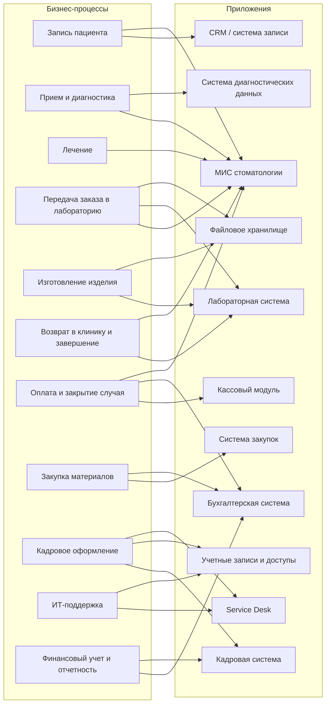

# Mermaid diagrams for task 4

Ниже собраны диаграммы задания 4 для сети `«Зубич»` в формате `Mermaid`.

Их можно:

- использовать прямо в Markdown;
- вставить в `draw.io` через `Insert -> Advanced -> Mermaid`;
- брать как основу для ручной доработки схем.

---

## 1. High-level business process map

---

## 2. Core clinical and laboratory process

---

## 3. Procurement process

---

## 4. IT support process

---

## 5. System and business application landscape

---

## 6. Process-to-application mapping

---

## 7. Short note

Если какой-то блок рендерится слишком широко, лучше:

- укорачивать подписи;
- разбивать одну большую диаграмму на две;
- использовать `flowchart LR` для карт приложений;
- использовать `flowchart TB` для процессов.
