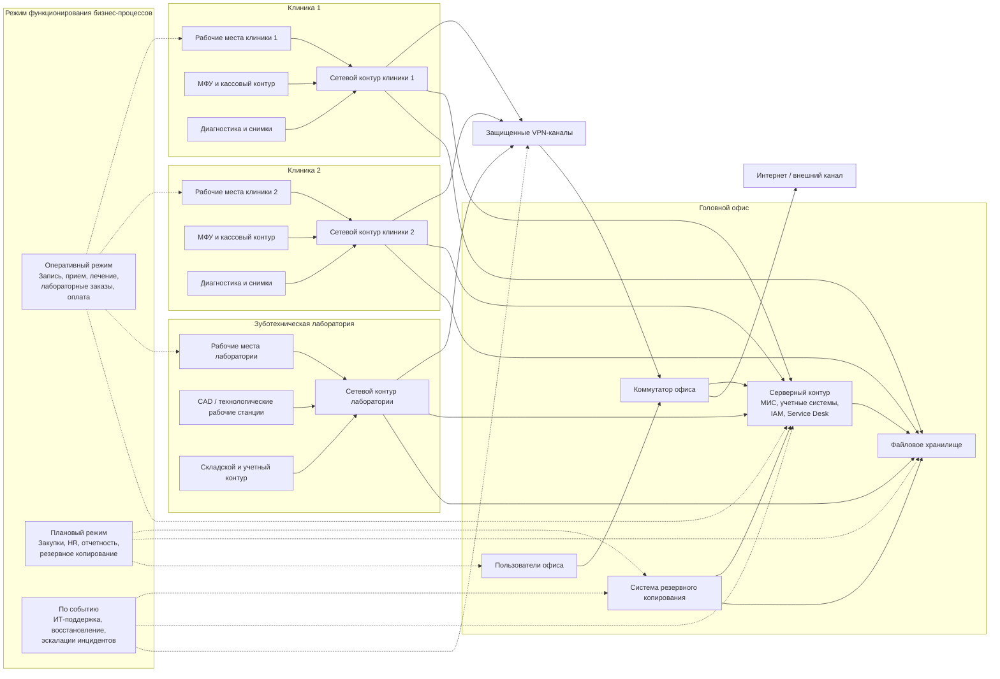

# Mermaid diagrams for task 5

Ниже собраны диаграммы для задания 5 по сети `«Зубич»` в формате `Mermaid`.

Их можно:

- использовать прямо в Markdown;
- вставить в `draw.io` через `Insert -> Advanced -> Mermaid`;
- доработать вручную после импорта.

---

## 1. Схема информационной инфраструктуры

Эта схема показывает:

- площадки предприятия;
- основные серверные и прикладные контуры;
- каналы связи между площадками;
- какие группы бизнес-процессов на этой инфраструктуре работают;
- режим функционирования бизнес-процессов.

---

## 2. Схема детального аппаратного обеспечения

Эта схема показывает аппаратную базу по площадкам: сетевое оборудование, пользовательские устройства, серверы, хранилища и резервирование.

```mermaid
flowchart TB
    subgraph officeSite["Головной офис"]
        officeRouter["Маршрутизатор / firewall"]
        officeCore["Ядро сети / коммутатор"]
        officeAdminPc["ПК офиса"]
        officeMfp["МФУ офиса"]
        officeWiFi["Точки доступа Wi-Fi"]

        subgraph serverRoom["Серверная"]
            virtHost["Виртуализационный сервер"]
            dbServer["Сервер баз данных"]
            appServer["Сервер приложений"]
            iamServer["Сервер учетных записей / IAM"]
            serviceDeskSrv["Сервер Service Desk"]
            nasMain["Основное сетевое хранилище"]
            backupSrv["Сервер резервного копирования"]
            backupNas["Резервное хранилище"]
            upsOffice["ИБП"]
        end
    end

    subgraph clinicOne["Клиника 1"]
        c1Router["Маршрутизатор / firewall"]
        c1Switch["Коммутатор"]
        c1WiFi["Точки доступа Wi-Fi"]
        c1Reception["ПК ресепшена"]
        c1Dentist["ПК врачей"]
        c1Assistant["ПК / терминал ассистентов"]
        c1Xray["Рабочая станция диагностики"]
        c1Cash["Кассовый терминал"]
        c1Mfp["МФУ клиники"]
    end

    subgraph clinicTwo["Клиника 2"]
        c2Router["Маршрутизатор / firewall"]
        c2Switch["Коммутатор"]
        c2WiFi["Точки доступа Wi-Fi"]
        c2Reception["ПК ресепшена"]
        c2Dentist["ПК врачей"]
        c2Assistant["ПК / терминал ассистентов"]
        c2Xray["Рабочая станция диагностики"]
        c2Cash["Кассовый терминал"]
        c2Mfp["МФУ клиники"]
    end

    subgraph labSite["Зуботехническая лаборатория"]
        labRouter["Маршрутизатор / firewall"]
        labSwitch["Коммутатор"]
        labWiFi["Точки доступа Wi-Fi"]
        labTechPc["ПК зубных техников"]
        labCadWs["CAD / технологическая станция"]
        labQcPc["ПК контроля качества"]
        labStorePc["ПК кладовщика"]
        labPrinter["Принтеры / маркировка"]
    end

    vpnCloud["VPN / защищенная связь"]
    internetCloud["Интернет"]

    officeAdminPc --> officeCore
    officeMfp --> officeCore
    officeWiFi --> officeCore
    officeCore --> officeRouter
    officeCore --> virtHost
    officeCore --> dbServer
    officeCore --> appServer
    officeCore --> iamServer
    officeCore --> serviceDeskSrv
    officeCore --> nasMain
    officeCore --> backupSrv
    backupSrv --> backupNas
    upsOffice --> virtHost
    upsOffice --> dbServer
    upsOffice --> appServer
    upsOffice --> iamServer
    upsOffice --> serviceDeskSrv
    upsOffice --> nasMain
    upsOffice --> backupSrv

    c1Reception --> c1Switch
    c1Dentist --> c1Switch
    c1Assistant --> c1Switch
    c1Xray --> c1Switch
    c1Cash --> c1Switch
    c1Mfp --> c1Switch
    c1WiFi --> c1Switch
    c1Switch --> c1Router

    c2Reception --> c2Switch
    c2Dentist --> c2Switch
    c2Assistant --> c2Switch
    c2Xray --> c2Switch
    c2Cash --> c2Switch
    c2Mfp --> c2Switch
    c2WiFi --> c2Switch
    c2Switch --> c2Router

    labTechPc --> labSwitch
    labCadWs --> labSwitch
    labQcPc --> labSwitch
    labStorePc --> labSwitch
    labPrinter --> labSwitch
    labWiFi --> labSwitch
    labSwitch --> labRouter

    officeRouter --> vpnCloud
    c1Router --> vpnCloud
    c2Router --> vpnCloud
    labRouter --> vpnCloud

    officeRouter --> internetCloud
    c1Router --> internetCloud
    c2Router --> internetCloud
    labRouter --> internetCloud
```

---

## 3. Короткое пояснение к режимам работы процессов

Для этой организации удобно использовать три режима:

- `Оперативный режим` - процессы, которые должны работать в течение рабочего дня почти без задержек: запись, прием, лечение, лабораторные заказы, касса.
- `Плановый режим` - процессы, которые идут по расписанию: отчетность, закупки, кадровые процедуры, резервное копирование.
- `Режим по событию` - процессы, которые запускаются при инциденте или запросе: ИТ-поддержка, восстановление после сбоя, аварийные переключения.

---

## 4. Как упростить при необходимости

Если какая-то диаграмма получается слишком большой, лучше:

- разделить инфраструктуру и режимы процессов на две отдельные схемы;
- вынести серверную головного офиса в отдельную диаграмму;
- оставить в аппаратной схеме только ключевые устройства, без повторов по каждому кабинету.
