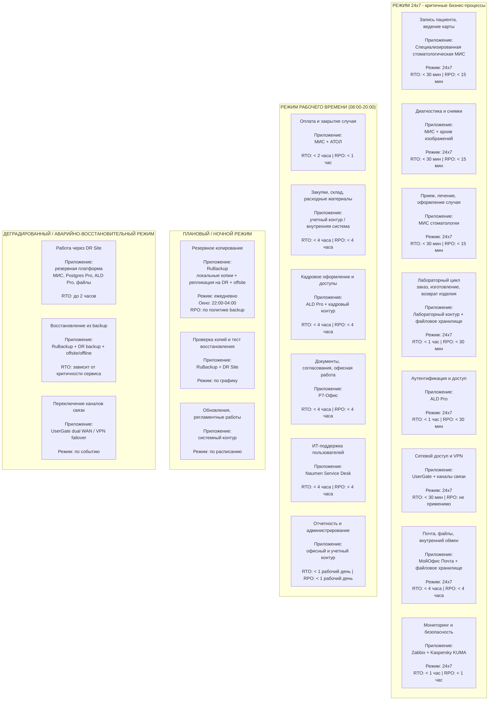

# Mermaid diagram for task 5 - business process operating modes

Ниже приведена **упрощенная Mermaid-схема** в стиле учебного примера:  
она показывает, какие бизнес-процессы и прикладные сервисы работают в разных режимах функционирования.

Схема сделана **без излишней инфраструктурной детализации**, чтобы ее было проще показывать преподавателю.

---

## Режимы функционирования бизнес-процессов

---

## Как читать схему

- **Режим 24x7** - самые критичные процессы, которые должны работать практически постоянно.
- **Режим рабочего времени** - процессы, допустимые к восстановлению в течение часов рабочего дня.
- **Плановый / ночной режим** - backup, тесты восстановления, обновления и регламентные работы.
- **Деградированный / аварийно-восстановительный режим** - сценарии отказа основной площадки и работы через DR Site.

---

## Зачем эта схема нужна

Эта версия удобна для защиты проекта, потому что она:

- показывает связь **процессов и приложений**;
- отражает **режимы функционирования**;
- не перегружена деталями серверной инфраструктуры;
- выглядит ближе к учебному формату, чем большая техническая схема.
