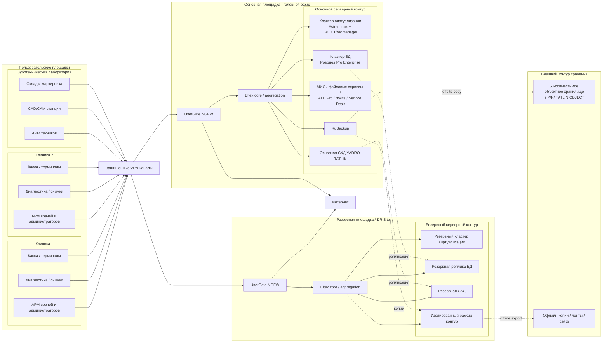
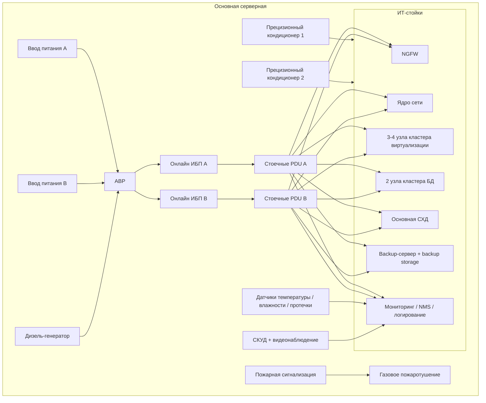
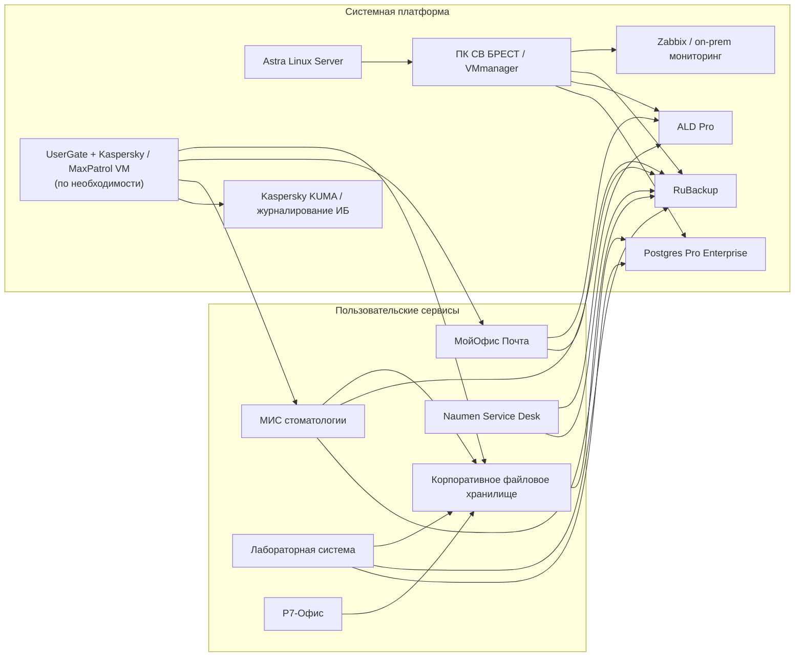
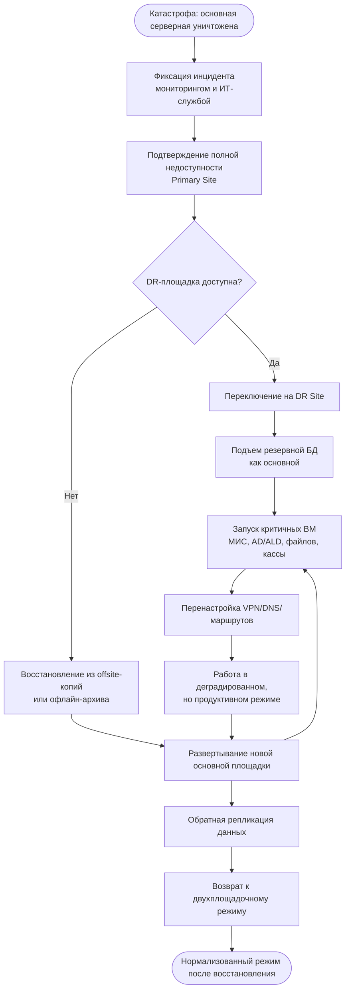
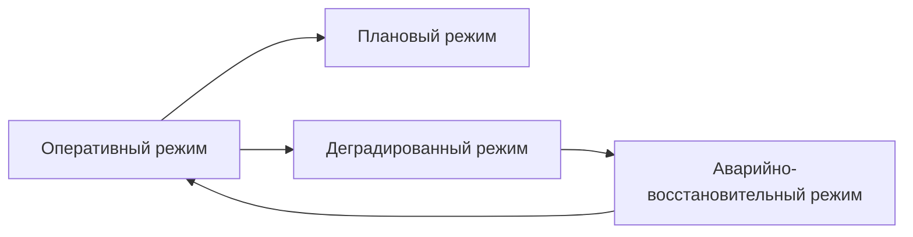

# Mermaid diagrams for task 5 - redesigned fault-tolerant infrastructure

Ниже приведена новая, доработанная версия задания 5 для сети `«Зубич»`.

Вариант спроектирован с учетом условий задачи:

- бюджет проекта не ограничен;
- критичные модели оборудования должны быть официально доступны в России;
- программное обеспечение и операционные системы подбираются из российского или официально поставляемого в РФ стека;
- архитектура должна переживать не только обычные отказы, но и катастрофический сценарий полной потери основной серверной;
- в проект включены инженерные системы серверной: питание, охлаждение, пожаротушение, мониторинг среды и физическая защита.

Ключевая идея проекта: **не строить одну "серверную комнату", а строить две площадки**:

1. **Основная площадка (Primary Site)** - в головном офисе.
2. **Резервная площадка (DR Site)** - в отдельном здании или в коммерческом российском ЦОД на территории РФ.

Это позволяет сохранить работоспособность даже при сценариях уровня:

- пожар в серверной;
- длительное отключение электропитания;
- затопление;
- отказ климатической системы;
- физическое уничтожение части оборудования;
- полная потеря основной площадки.

---

## 1. Архитектура информационной инфраструктуры

Диаграмма показывает:

- все площадки организации;
- разделение на основную и резервную ИТ-площадки;
- прикладные сервисы;
- защищенные каналы связи;
- внешнее резервное хранилище копий.

---

## 2. Детальная схема серверной и инженерной инфраструктуры

Эта схема отражает не только ИТ-оборудование, но и то, без чего серверная в реальном проекте не живет:

- двухлучевое питание;
- ИБП;
- дизель-генератор;
- кондиционирование по схеме `N+1`;
- газовое пожаротушение;
- контроль доступа и датчики среды.

---

## 3. Схема прикладного и системного стека

Здесь показаны сервисы, которые разумно использовать без VMware / Cisco и без завязки на санкционный стек.

---

## 4. Сценарий аварийного восстановления при полной потере основной площадки

Самая важная схема для этой задачи: что происходит, если основная серверная перестала существовать полностью.

---

## 5. Режимы функционирования бизнес-процессов

Для проекта удобно выделить четыре режима, а не три:

1. **Оперативный режим**  
   Повседневная работа клиник, лаборатории, кассы, регистратуры, диагностики.

2. **Плановый режим**  
   Ночные резервные копии, обновления, отчеты, профилактика, тест восстановления.

3. **Деградированный режим**  
   Работа через резервную площадку, при пониженной производительности и отключении второстепенных сервисов.

4. **Аварийно-восстановительный режим**  
   Отработка катастрофы, запуск DR-площадки, восстановление из offsite и офлайн-копий.

---

## 6. Практические проектные решения, которые обязательно стоит указать в пояснении

### 6.1. Защита от потери площадки

- Основная и резервная площадки должны быть территориально разнесены.
- Резервная площадка не должна находиться в том же здании, что и основная серверная.
- Минимум одна копия данных должна храниться **вне основной площадки**.
- Минимум одна копия должна быть **неизменяемой** или **офлайн**, чтобы защититься от шифровальщиков и ошибок администратора.

### 6.2. Политика резервного копирования

Рекомендуется схема `3-2-1-1-0`:

- **3** копии данных;
- **2** разных типа носителей;
- **1** копия вне площадки;
- **1** копия офлайн или immutable;
- **0** ошибок при проверке восстановления.

Для проекта это можно реализовать так:

- основная рабочая копия - на основной СХД;
- backup-копия - на backup-хранилище в основной серверной;
- реплика backup - на DR-площадку;
- immutable/offsite - в S3-совместимое хранилище в РФ;
- офлайн-экспорт наиболее критичных архивов - на ленты или съемные носители в сейфе.

### 6.3. Питание

- два независимых ввода электропитания;
- АВР;
- онлайн ИБП с двойным преобразованием;
- время автономии до запуска ДГУ;
- дизель-генератор для длительной автономной работы;
- раздельные линии `A/B` до стоек и устройств с двумя блоками питания.

### 6.4. Охлаждение

- отдельная серверная без совмещения с бытовыми помещениями;
- прецизионное кондиционирование;
- резервирование `N+1`;
- поддержание температуры и влажности в допустимом диапазоне;
- датчики температуры, влажности и протечки;
- запрет на обычные бытовые сплит-системы как единственный способ охлаждения критичной серверной.

### 6.5. Пожаротушение

- раннее обнаружение дыма и перегрева;
- автоматическая пожарная сигнализация;
- газовое пожаротушение, безопасное для серверного оборудования;
- автоматическое отключение питания в сценарии пожара по утвержденному проекту;
- регламент допуска персонала после срабатывания.

### 6.6. Сетевой и информационный периметр

- NGFW на основной и резервной площадках;
- site-to-site VPN для филиалов;
- отдельные VLAN для врачей, администраторов, касс, Wi-Fi, диагностики, серверов и управления;
- журналирование событий безопасности;
- централизованный мониторинг;
- регулярная проверка восстановления резервных копий.

---

## 7. Что брать в текстовую часть проекта

Если эту версию нужно использовать как основу для сдачи, в текстовую часть стоит включить:

- обоснование двухплощадочной архитектуры;
- обоснование выбора российского и официально доступного в РФ стека;
- перечень критичных ИС и их приоритет восстановления;
- параметры `RPO/RTO` хотя бы в учебном виде;
- описание резервного копирования и DR-сценария;
- инженерное обеспечение серверной;
- таблицу оборудования из `table5.md`.

---

## 8. Короткий вывод

Для этой задачи лучшее решение при неограниченном бюджете - не "самая дорогая серверная", а **отказоустойчивая распределенная инфраструктура**:

- основная площадка;
- резервная площадка;
- российский или официально доступный в России стек оборудования и ПО;
- резервное копирование по схеме `3-2-1-1-0`;
- инженерная защита серверной;
- готовый сценарий работы даже при полном уничтожении основной серверной.
