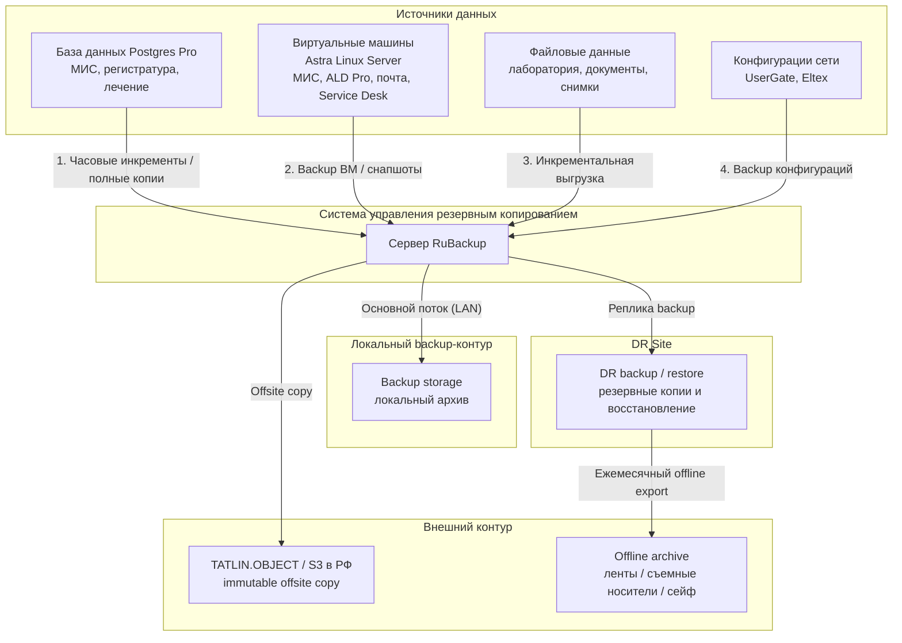
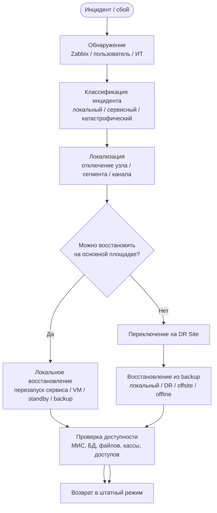

# Задание 6 - анализ рисков, резервное копирование и восстановление ИТ-инфраструктуры сети «Зубич»

Ниже приведен вариант задания 6 для предприятия `«Зубич»` - сети стоматологических клиник с зуботехнической лабораторией, головным офисом, основной серверной площадкой и резервной площадкой `DR Site`.

Документ включает:

1. анализ рисков по бизнес-процессам;
2. анализ рисков по ИТ-инфраструктуре;
3. схему резервного копирования информации;
4. план восстановления ИТ-инфраструктуры после сбоев.

В основе документа используется уже выбранная архитектура:

- основная площадка `Primary Site`;
- резервная площадка `DR Site`;
- offsite / offline контур резервного копирования;
- российский и официально доступный в РФ стек:
  - `UserGate`
  - `Eltex`
  - `Aquarius`
  - `YADRO`
  - `Astra Linux`
  - `ALD Pro`
  - `Postgres Pro`
  - `RuBackup`
  - `Р7-Офис`
  - `МойОфис`

---

## 1. Анализ рисков бизнес-процессов

Цель раздела - выявить угрозы для ключевых бизнес-процессов стоматологической сети, оценить их влияние на работу предприятия и определить организационные меры по снижению ущерба.

Для оценки применяется упрощенная матрица:

- **Вероятность:** Низкая / Средняя / Высокая
- **Влияние:** Среднее / Высокое / Критическое

### 1.1. Матрица рисков бизнес-процессов

| Бизнес-процесс | Сценарий отказа / угроза | Вероятность | Влияние | Бизнес-последствия | Организационные меры снижения риска |
|---|---|---|---|---|---|
| Запись пациента | Недоступность МИС, онлайн-записи или регистратуры | Средняя | Высокое | невозможность быстро записывать пациентов, потеря обращений, перенос расписания | временная запись по телефону и в локальные таблицы, ручное ведение листов ожидания, последующее внесение данных в МИС |
| Прием и оформление | Недоступность учетных записей, МИС или рабочих мест ресепшена | Средняя | Критическое | задержка приема, образование очередей, срыв графика врачей | бумажные формы приема, временная локальная регистрация пациентов, приоритет экстренных случаев |
| Диагностика и план лечения | Недоступность снимков, диагностической станции или архива изображений | Средняя | Высокое | невозможность принять часть клинических решений, перенос процедур, задержка лечения | использование локально сохраненных данных, перенос неэкстренных услуг, бумажная фиксация предварительных результатов |
| Лечение | Недоступность МИС, карты пациента или сети в кабинете | Низкая | Критическое | часть лечебных процедур приходится приостанавливать, растет риск ошибок в документации | бумажное дублирование критичной информации, завершение только безопасных процедур, последующее внесение записей в систему |
| Лабораторный цикл | Сбой обмена между клиниками и лабораторией, недоступность файлов заказов или CAD/CAM | Средняя | Высокое | задержка изготовления изделий, перенос установки, рост недовольства пациентов | фиксация заказов в бумажном журнале, временный обмен по защищенному резервному каналу, повторная синхронизация после восстановления |
| Оплата и закрытие случая | Недоступность кассового ПО, терминала или связи с фискальным контуром | Средняя | Высокое | невозможность быстро закрывать визиты, задержки оплаты, риск финансовых ошибок | резервная касса, временный прием наличных по регламенту, повторное проведение операций после восстановления |
| Закупки и склад | Недоступность складского учета и заявок на материалы | Средняя | Среднее | задержка заказа расходников, риск дефицита материалов | резервный учет критичных остатков в таблицах, минимальные страховые запасы, ручное согласование срочных закупок |
| Кадровое оформление и доступы | Недоступность каталога учетных записей или кадрового контура | Низкая | Среднее | задержка выдачи доступов, проблемы при вводе новых сотрудников | временная выдача ограниченных локальных доступов по регламенту, оформление заявок через Service Desk |
| ИТ-поддержка | Недоступность системы заявок или средств удаленного доступа | Средняя | Среднее | снижение скорости устранения инцидентов, рост времени простоя у пользователей | резервные каналы связи с ИТ, телефон / мессенджер как временный канал регистрации инцидентов |
| Отчетность и управление | Недоступность офисного контура, почты или документов | Средняя | Среднее | задержка согласований, отчетов, внутренних процессов | временное использование локальных документов, перенос второстепенных задач, ручное согласование критичных решений |

### 1.2. Вывод по бизнес-рискам

Для сети стоматологий наибольший ущерб несут:

- недоступность МИС;
- недоступность кассового и приемного контура;
- сбой лабораторного обмена;
- потеря доступа к данным пациента и диагностическим материалам.

Организационные меры позволяют пережить краткосрочный инцидент, но не заменяют отказоустойчивую ИТ-архитектуру. Поэтому ключевым способом снижения бизнес-рисков является:

- резервирование площадок;
- резервирование каналов связи;
- резервирование данных и систем;
- наличие DR Site;
- регулярная проверка восстановления.

---

## 2. Анализ рисков ИТ-инфраструктуры

В этом разделе рассматриваются технические угрозы, которые нарушают:

- доступность;
- целостность;
- конфиденциальность;
- непрерывность работы.

### 2.1. Физические и инфраструктурные угрозы

| Угроза | Вероятность | Возможные последствия | Методы снижения риска |
|---|---|---|---|
| Отказ физического сервера виртуализации | Средняя | остановка части виртуальных машин, недоступность прикладных систем | кластер виртуализации из нескольких узлов, N+1, возможность перезапуска ВМ на оставшихся узлах |
| Отказ узла БД | Средняя | недоступность МИС и критичных сервисов | двухузловой контур `Postgres Pro`, репликация и быстрое переключение |
| Повреждение дисков / массива | Высокая | потеря части данных, остановка записи, деградация сервисов | RAID, отказоустойчивая СХД, регулярные backup, репликация на DR Site |
| Полное отключение электропитания | Средняя | аварийное отключение серверов, повреждение БД и файловых систем | 2 ввода питания, `online UPS`, АВР, ДГУ |
| Отказ климатической системы | Средняя | перегрев серверов и вынужденная остановка оборудования | кондиционирование `N+1`, мониторинг температуры, оповещение |
| Пожар / затопление / разрушение серверной | Низкая / Средняя | полная потеря основной площадки | DR Site, offsite backup, offline archive, газовое пожаротушение, регламент переключения |
| Отказ коммутатора ядра или обрыв магистрали внутри офиса | Средняя | потеря связи между площадками и серверным контуром | резервирование сетевого оборудования, запасной фонд, документированная конфигурация, резервные каналы |
| Отказ канала интернет-связи или провайдера | Средняя | потеря VPN, внешнего доступа, части интеграций | два независимых провайдера, dual WAN, LTE fallback, резервные VPN-туннели |

### 2.2. Информационные угрозы и киберриски

| Угроза | Вероятность | Возможные последствия | Методы снижения риска |
|---|---|---|---|
| Вирус-шифровальщик на рабочих местах | Высокая | шифрование файлов, недоступность документов и сетевых ресурсов | сегментация VLAN, антивирусный контроль, ограничение прав, immutable/offline backup |
| Компрометация учетных данных | Высокая | несанкционированный доступ к МИС, почте, сервисам администрирования | `ALD Pro`, строгая парольная политика, MFA / токены для критичных ролей, аудит входов |
| DDoS или внешняя атака на опубликованные сервисы | Средняя | недоступность внешних сервисов, перегрузка каналов | `UserGate`, dual WAN, фильтрация трафика, публикация только необходимых сервисов |
| Ошибочное удаление данных сотрудником | Высокая | потеря документов, искажение данных пациента, удаление записей | регулярные backup, снапшоты, разграничение прав, журналирование действий |
| Умышленная утечка данных | Низкая / Средняя | нарушение закона о персональных данных, репутационный и финансовый ущерб | контроль доступов, журналирование, ограничение копирования, DLP-подходы по регламенту |
| Повреждение данных из-за неудачного обновления | Средняя | недоступность систем, ошибки совместимости, простой | регламент обновлений, тестовый контур, запрет обновлений в критические периоды, backup перед изменениями |

### 2.3. Риски человеческого фактора

| Угроза | Вероятность | Последствия | Методы контроля |
|---|---|---|---|
| Ошибка администратора при изменении сети или виртуализации | Средняя | недоступность сервисов, нарушение маршрутизации, сбой доступа | change management, резервные конфигурации, двойная проверка изменений |
| Неправильное восстановление из backup | Средняя | длительный простой, потеря части данных | регламенты восстановления, тестовые учения, инструкции по DR |
| Несоблюдение регламентов обработки инцидентов | Средняя | хаотичные действия, увеличение ущерба | единая инструкция по инцидентам, роли и ответственные лица |

### 2.4. Вывод по ИТ-рискам

Для вашего предприятия защита должна строиться по принципу многослойной устойчивости:

- резервирование вычислений;
- резервирование каналов связи;
- backup по схеме `3-2-1-1-0`;
- DR Site;
- сегментация сети;
- централизованное управление доступами;
- инженерная защита серверной.

Ни одно средство само по себе не закрывает все риски. Только сочетание:

- архитектурного резервирования;
- организационных регламентов;
- средств защиты информации;
- регулярного тестирования восстановления

дает приемлемый уровень устойчивости.

---

## 3. Схема резервного копирования информации

Политика backup строится по принципу:

- **3** копии данных;
- **2** типа носителей;
- **1** копия вне основной площадки;
- **1** immutable или offline копия;
- **0** ошибок при проверке восстановления.

### 3.1. Что резервируется

| Объект резервного копирования | Тип копии | Периодичность | Место хранения | Глубина хранения |
|---|---|---|---|---|
| База данных `Postgres Pro` (МИС) | инкрементальная / журнальная | каждый час или чаще | локальный backup-контур + DR Site | 7-14 дней |
| База данных `Postgres Pro` (МИС) | полная | ежедневно ночью | локальный backup + DR Site + offsite | 30 дней |
| Виртуальные машины прикладного контура | backup образов / снапшоты | ежедневно / по политике | backup-сервер + DR Site | 14-30 дней |
| Файловое хранилище и лабораторные данные | инкрементальная | ежедневно | локальное backup-хранилище + offsite | 30 дней |
| Почта и документы | полная / инкрементальная | ежедневно | локально + offsite | 30 дней |
| Конфигурации сетевого оборудования | текстовые backup-файлы | при каждом изменении | локальный backup + offsite | все версии |
| Критичные архивы | offline export | ежемесячно | offline носитель / сейф | по регламенту архива |

### 3.2. Mermaid-схема резервного копирования

### 3.3. Комментарий к схеме резервного копирования

Смысл схемы:

- локальный backup нужен для **быстрого восстановления**;
- `DR Site` нужен для **защиты от потери основной площадки**;
- `offsite / immutable` нужен для **защиты от шифровальщиков и логической порчи данных**;
- `offline archive` нужен для **катастрофических сценариев и последнего рубежа восстановления**.

---

## 4. План восстановления ИТ-инфраструктуры после сбоев

План восстановления должен быть не абстрактным, а пошаговым.

### 4.1. Общие принципы

При любом серьезном инциденте выполняются этапы:

1. **Обнаружение** - мониторинг, пользовательское обращение или контроль инфраструктуры.
2. **Локализация** - ограничение зоны инцидента, чтобы он не распространился дальше.
3. **Переключение или восстановление** - запуск резерва, DR или backup.
4. **Проверка** - контроль доступности критичных сервисов.
5. **Возврат в штатный режим** - после устранения причины.

### 4.2. Сценарий А - отказ основного узла виртуализации

1. `Zabbix` фиксирует недоступность хоста.
2. Дежурный администратор подтверждает отказ и исключает узел из продуктивного контура.
3. Виртуальные машины автоматически или вручную запускаются на оставшихся узлах кластера.
4. Проверяется доступность:
   - МИС;
   - ALD Pro;
   - почты;
   - файлового контура.
5. После ремонта или замены узел возвращается в кластер.

### 4.3. Сценарий Б - отказ БД или повреждение данных

1. Фиксируется недоступность `Postgres Pro` или признаки логической порчи данных.
2. При аппаратном отказе выполняется переключение на standby-узел.
3. При логической порче выполняется восстановление:
   - из последних журналов / инкрементов;
   - либо из ближайшей полной копии.
4. Проверяется доступность МИС и целостность записей.
5. Выполняется разбор инцидента и корректировка регламента backup.

### 4.4. Сценарий В - заражение вирусом-шифровальщиком

1. Немедленно изолируется зараженный сегмент:
   - отключение от сети;
   - блокировка части VLAN;
   - ограничение внешнего доступа на `UserGate`.
2. Компрометированные рабочие станции переустанавливаются из эталонных образов.
3. Критичные данные восстанавливаются из:
   - локального backup;
   - immutable offsite-копии;
   - offline-контуров, если локальные копии затронуты.
4. Сменяются учетные данные, анализируются логи, выполняется аудит доступа.

### 4.5. Сценарий Г - отказ основного интернет-канала

1. `UserGate` автоматически переводит трафик на резервного провайдера.
2. Если оба проводных канала недоступны, включается LTE fallback для критичных сервисов.
3. Ограничивается некритичный внешний трафик.
4. Поддерживается работа:
   - VPN филиалов;
   - доступа к DR Site;
   - основных клинических сервисов.

### 4.6. Сценарий Д - полная потеря Primary Site

1. Инцидент подтверждается как катастрофический.
2. Принимается решение о переходе в аварийно-восстановительный режим.
3. На `DR Site` поднимаются в первую очередь:
   1. `ALD Pro`
   2. `Postgres Pro`
   3. МИС
   4. файловые сервисы и лабораторный обмен
   5. кассовый контур
   6. почта и вторичные сервисы
4. Филиалы переводятся на резервные VPN-маршруты.
5. При необходимости выполняется восстановление части данных из offsite / offline копий.
6. После стабилизации сервисов начинается план восстановления новой основной площадки.

### 4.7. Mermaid-схема восстановления после сбоя

---

## 5. Тестирование плана восстановления

Чтобы план действительно работал, его нужно регулярно проверять.

Рекомендуется:

- ежеквартально тестировать восстановление отдельной папки или файла;
- ежеквартально тестировать восстановление БД в изолированную среду;
- не реже двух раз в год проводить учебный failover на DR Site;
- проверять корректность backup конфигураций сетевого оборудования;
- документировать результаты тестов и замечания.

---

## 6. Короткий вывод

Для предприятия `«Зубич»` наибольшие риски связаны с:

- недоступностью МИС;
- потерей связи с филиалами;
- отказом БД;
- потерей данных пациента и лабораторного обмена;
- полной потерей основной площадки.

Снизить эти риски позволяет не одна мера, а их комбинация:

- резервирование вычислений;
- резервирование каналов связи;
- backup по схеме `3-2-1-1-0`;
- `DR Site`;
- offsite и offline копии;
- организационный регламент реакции на инциденты.

Именно такой подход делает ИТ-инфраструктуру устойчивой и позволяет сохранить непрерывность ключевых бизнес-процессов даже при серьезных сбоях.
