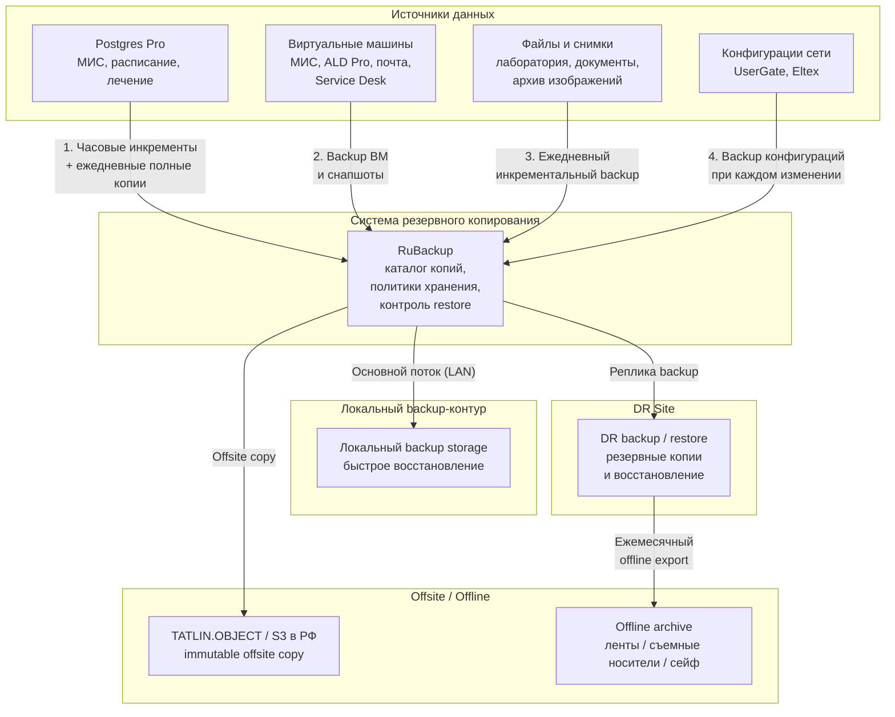
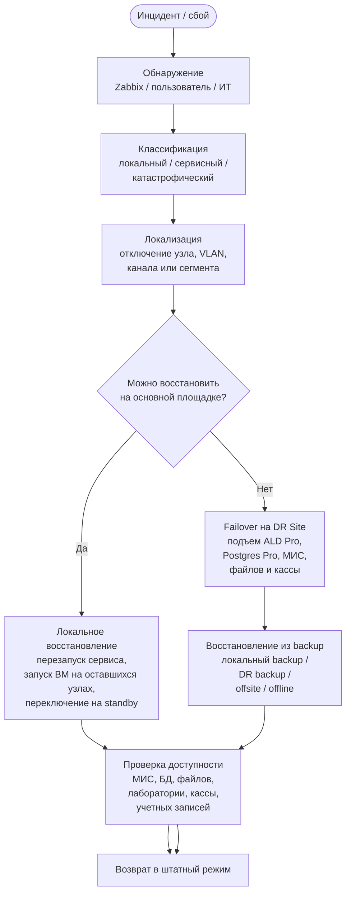

# Mermaid diagrams for task 6 - backup and recovery

Ниже приведены **две отдельные Mermaid-схемы** для задания 6:

1. схема резервного копирования информации;
2. схема восстановления ИТ-инфраструктуры после сбоев.

Они сделаны в более компактном виде, чтобы их было удобно:

- вставлять в отчет;
- открывать в Markdown;
- импортировать в draw.io через `Insert -> Advanced -> Mermaid`.

---

## 1. Схема резервного копирования информации

---

## 2. Схема восстановления ИТ-инфраструктуры после сбоев

---

## 3. Короткие пояснения

### Что показывает первая схема

- из каких источников берутся данные;
- как ими управляет `RuBackup`;
- куда уходят локальные, DR, offsite и offline копии.

### Что показывает вторая схема

- как ИТ-служба реагирует на инцидент;
- когда хватает локального восстановления;
- когда требуется переход на `DR Site`;
- когда используются резервные копии.

---

## 4. Как это использовать в работе

Если нужна **одна** схема для отчета, обычно лучше вставлять:

- первую диаграмму в раздел **резервного копирования**;
- вторую диаграмму в раздел **плана восстановления после сбоев**.
